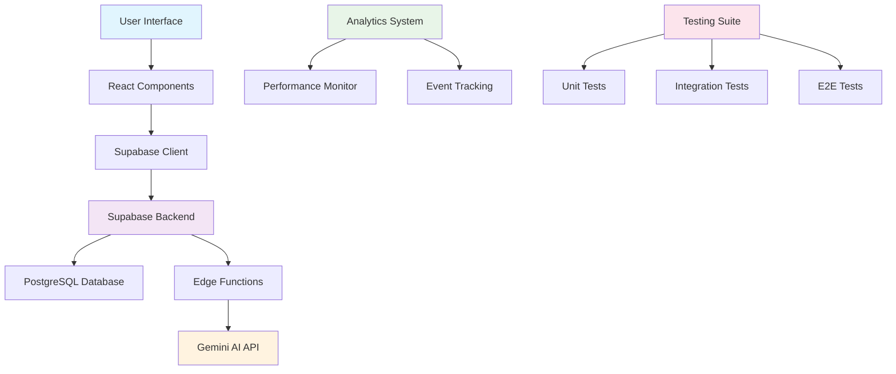

# Career Compass 🧭

A comprehensive AI-powered career assessment platform that helps users discover their strengths, interests, and ideal career paths through a scientifically-backed 6-layer evaluation system.

## 🚀 Features

### Core Assessment System
- **6-Layer Assessment Model**: Progressive evaluation from intelligence types to career clustering
- **AI-Powered Insights**: Real-time explanations and suggestions using Google's Gemini API
- **Comprehensive Results**: Visual charts, strengths analysis, and actionable recommendations
- **PDF Export**: Professional assessment reports for career counseling

### Technical Highlights  
- **Modern Stack**: React 18, TypeScript, Tailwind CSS, Vite
- **Backend**: Supabase for authentication, database, and serverless functions
- **Testing**: Comprehensive test suite with Vitest, React Testing Library, and Playwright
- **Performance**: Optimized with debouncing, caching, and rate limiting
- **Analytics**: Built-in performance monitoring and user behavior tracking

## 📊 Architecture

<div align="center">



</div>

### Data Flow
1. **User Authentication**: Supabase Auth with email/password and OAuth
2. **Assessment Progress**: Real-time saving of responses to PostgreSQL
3. **AI Integration**: Serverless functions proxy requests to Gemini API
4. **Results Generation**: Dynamic charts and insights from assessment data
5. **Analytics**: Performance monitoring and user behavior tracking

## 🧪 Assessment Layers

| Layer | Focus Area | Question Types | Purpose |
|-------|------------|----------------|---------|
| **1** | Multiple Intelligences & Cognitive Styles | Likert Scale | Identify natural aptitudes |
| **2** | Personality & Motivation | Likert Scale | Understand work preferences |
| **3** | Skills & Aptitudes | Likert Scale | Assess current capabilities |
| **4** | Background & Context | Likert Scale | Consider external factors |
| **5** | Interests & Goals | Likert Scale | Align with personal values |
| **6** | Career Clustering & Synthesis | Mixed | Final career matching |

## 🛠 Installation & Setup

### Prerequisites
- Node.js 18+ 
- Supabase account
- Google Gemini API key

### Quick Start
```bash
# Clone the repository
git clone https://github.com/your-username/career-compass.git
cd career-compass

# Install dependencies
npm install

# Set up environment variables
cp .env.example .env
# Add your Supabase URL and keys to .env

# Run database migrations
npm run db:migrate

# Start development server
npm run dev
```

### Environment Variables
```env
VITE_SUPABASE_URL=your_supabase_url
VITE_SUPABASE_ANON_KEY=your_supabase_anon_key
GEMINI_API_KEY=your_gemini_api_key
```

## 🧪 Testing

### Run All Tests
```bash
# Unit and integration tests
npm run test

# E2E tests
npm run test:e2e

# Test coverage
npm run test:coverage
```

### Test Structure
- **Unit Tests**: Individual functions and hooks (`src/**/__tests__/`)
- **Component Tests**: React component behavior (`src/**/__tests__/`)
- **Integration Tests**: API and database interactions
- **E2E Tests**: Complete user journeys (`e2e/`)

## 🚀 Performance Optimizations

### AI Request Management
- **Debouncing**: Prevents rapid-fire AI requests (1s delay)
- **Caching**: TTL-based response caching (5min default)
- **Rate Limiting**: 10 requests per minute per user
- **Batch Processing**: Efficient database operations

### Monitoring & Analytics
- **Core Web Vitals**: LCP, FID, CLS tracking
- **Custom Metrics**: AI response times, error rates
- **User Analytics**: Assessment progress, feature usage
- **Performance Alerts**: Automatic slow operation detection

## 📱 Deployment

### Production Build
```bash
npm run build
npm run preview
```

### Supabase Deployment
```bash
# Deploy edge functions
npx supabase functions deploy

# Apply database migrations
npx supabase db push
```

## 🔐 Security Features

- **Row Level Security (RLS)**: User data isolation
- **Authentication**: Supabase Auth with multiple providers
- **API Rate Limiting**: Prevents abuse and ensures fair usage
- **Input Validation**: Comprehensive client and server-side validation
- **CORS Configuration**: Secure cross-origin requests

## 📈 Analytics & Monitoring

### Tracked Events
- Assessment progress and completion
- AI assistance usage patterns
- Performance metrics and errors
- User interaction patterns

### Performance Targets
- **AI Response Time**: < 3 seconds
- **Page Load Time**: < 2 seconds
- **Test Coverage**: > 80%
- **Core Web Vitals**: All "Good" ratings

## 🤝 Contributing

1. Fork the repository
2. Create a feature branch: `git checkout -b feature/amazing-feature`
3. Commit changes: `git commit -m 'Add amazing feature'`
4. Push to branch: `git push origin feature/amazing-feature`
5. Open a Pull Request

### Development Guidelines
- Write tests for new features
- Follow TypeScript strict mode
- Use semantic commit messages
- Maintain test coverage above 80%

## 📚 API Documentation

### Supabase Functions

#### `/gemini-assist`
AI-powered assistance for assessment questions.

**Request:**
```typescript
{
  mode: 'explain' | 'suggest' | 'chat'
  question: string
  context?: any
}
```

**Response:**
```typescript
{
  generatedText: string
}
```

## 🐛 Troubleshooting

### Common Issues
- **Build Failures**: Check TypeScript errors and dependency versions
- **AI Timeouts**: Verify Gemini API key and network connectivity
- **Database Errors**: Ensure RLS policies are correctly configured
- **Test Failures**: Run tests in isolation to identify conflicts

### Performance Issues
- Clear AI response cache: `localStorage.clear()`
- Check rate limiting status in browser console
- Monitor network requests for slow API calls

## 📄 License

This project is licensed under the MIT License - see the [LICENSE](LICENSE) file for details.

## 🙏 Acknowledgments

- **Supabase**: Backend infrastructure and authentication
- **Google Gemini**: AI-powered insights and explanations  
- **shadcn/ui**: Beautiful and accessible UI components
- **Recharts**: Data visualization for assessment results

---

<div align="center">

**[🌟 Star this project](https://github.com/your-username/career-compass)** | **[🐛 Report Bug](https://github.com/your-username/career-compass/issues)** | **[💡 Request Feature](https://github.com/your-username/career-compass/issues)**

Built with ❤️ for career exploration and personal growth.

</div>